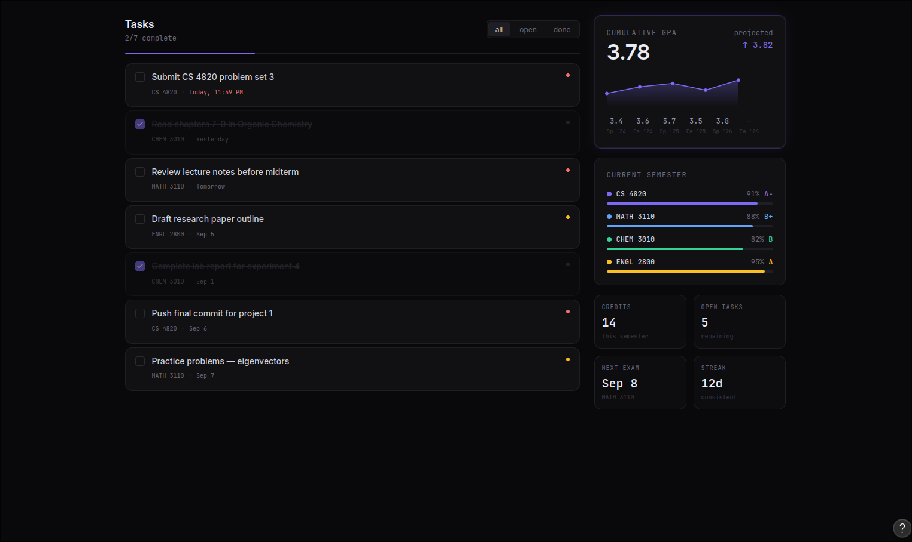
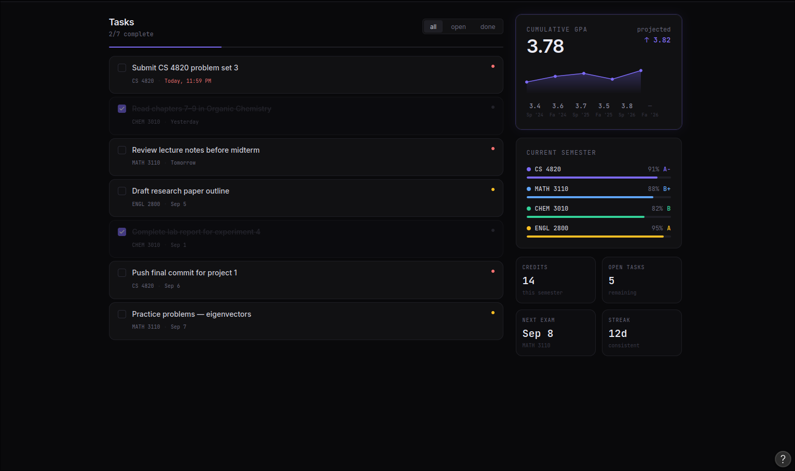

# Axiom

A custom Canvas LMS dashboard that calculates grades, projects performance trends, and runs what-if simulations through a native C++ calculation engine.

Most LMS interfaces hide how course weights are applied or make it tedious to calculate what you need on upcoming exams. Axiom pulls active course and assignment data from the Canvas API and offloads the math to a C++ Node-API addon.

## Screenshots

<p align="center">
  
  
</p>

## Highlights

- **Live Canvas Integration:** Pulls active courses, assignment groups, and grades directly through the Canvas REST API.
- **Offline Mock Mode:** If you do not have a Canvas API token, the backend can serve sample course data so you can test and explore the UI without setup.
- **C++ Calculation Engine:** Built with C++17 and Node-API (node-addon-api). Handles weighted category math, drop rules, and matrix operations directly in native code.
- **Performance Forecasting:** Uses ordinary least squares (linear regression) on chronological assignment scores to project final grades based on current trajectory.
- **What-If Solver:** Calculate the exact scores you need on remaining assignments or finals to lock in target letter grades (A, B, etc.).
- **Minimal Glass UI:** Built with React 19, Vite, and custom dark glass styling.

## Architecture

```
Frontend (React 19 + Vite)
      │
      │ REST / JSON
      ▼
Backend (Node.js + Express)
   ├── Canvas Client (Canvas LMS API or mock provider)
   └── Native Bridge (node-addon-api)
            │
            ▼
      C++ Engine (C++17)
      • Category weight vector math
      • Min-heap score drop rules
      • Least-squares trend regression
      • Constrained what-if target solver
```

## Tech Stack

- **Frontend:** React 19, Vite, CSS (Glassmorphism, Space Mono)
- **Backend:** Node.js, Express, CORS
- **Native Engine:** C++17, Node-API (`node-addon-api`), `node-gyp`, CMake
- **External API:** Canvas LMS REST API

## Getting Started

### Prerequisites

- Node.js (v18 or higher recommended)
- npm
- C++ compiler with C++17 support (gcc, clang, or MSVC)
- Python 3 (required by `node-gyp` to build the native addon)

### 1. Clone the repository

```bash
git clone https://github.com/your-username/Axiom.git
cd Axiom
```

### 2. Set up and build the backend

```bash
cd backend
npm install
npx node-gyp rebuild
```

This compiles the C++ engine in `cpp_engine/src/addon.cc` into `build/Release/addon.node`.

### 3. Set up the frontend

Open a second terminal window:

```bash
cd frontend
npm install
```

### 4. Configure environment variables (optional)

If you have a Canvas API key, create a `.env` file in the `backend/` folder:

```env
CANVAS_BASE_URL=https://canvas.instructure.com/api/v1/
CANVAS_API_KEY=your_token_here
PORT=5000
```

> Note: If you skip this step or do not provide a token, Axiom can run in Mock Mode with sample courses and assignments so everything works out of the box.

### 5. Run the application

Start the backend server:

```bash
# In backend/
npm start
```

Start the frontend development server:

```bash
# In frontend/
npm run dev
```

Open your browser to `http://localhost:5173` (or the port shown by Vite).

## Project Structure

```
Axiom/
├── backend/
│   ├── binding.gyp              # node-gyp build configuration
│   ├── cpp_engine/
│   │   ├── CMakeLists.txt       # standalone CMake build setup
│   │   ├── main.cpp             # local C++ test runner
│   │   └── src/
│   │       └── addon.cc         # Node-API bindings and C++ math functions
│   ├── src/
│   │   ├── canvas-API.js        # Canvas API client and mock provider
│   │   └── server.js            # Express REST server
│   └── package.json
├── frontend/
│   ├── src/
│   │   ├── App.jsx              # Main dashboard view
│   │   ├── App.css              # Custom styling
│   │   └── Card.jsx             # Course and assignment card components
│   ├── package.json
│   └── vite.config.js
├── ideas/
│   └── screenshots/             # Design mockups and screenshots
├── plans/
│   └── ENGINEERING_ROADMAP.md   # Architecture roadmap and sprint tasks
└── README.md
```

## Roadmap

- [x] Basic Canvas API course fetching
- [x] Node-API C++ addon boilerplate and compilation pipeline
- [x] Glassmorphic dashboard prototype
- [ ] Parse assignment groups, weights, and drop rules from Canvas
- [ ] Move category weighting and min-heap drop logic into C++ addon
- [ ] Implement least-squares trajectory regression in C++
- [ ] Add interactive what-if sliders to the React frontend
- [ ] Automated benchmarks comparing C++ engine vs pure JavaScript

## License

This project is licensed under the MIT License. See [LICENSE](LICENSE) for details.
